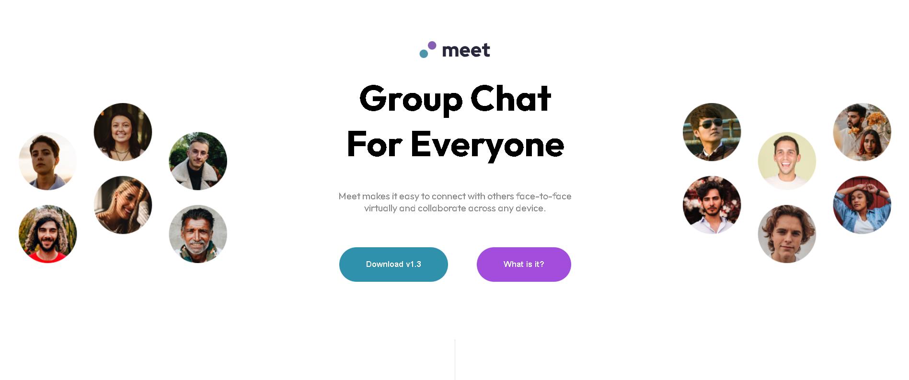

# Frontend Mentor - Meet landing page solution

This is a solution to the [Meet landing page challenge on Frontend Mentor](https://www.frontendmentor.io/challenges/meet-landing-page-rbTDS6OUR). 

### The challenge

Users should be able to:

- View the optimal layout depending on their device's screen size
- See hover states for interactive elements

### Screenshot

### Links

- Live site URL: [ live site URL ](https://meet-landing-page-wheat-mu.vercel.app/)
- Solution URL: [Solution URL](https://www.frontendmentor.io/solutions/meet-landing-page-using-grid-SMu1vahvD3)

## My process

### Built with

- Semantic HTML5 markup
- CSS custom properties
- Flexbox
- CSS Grid
- Mobile-first workflow

## Author
Name: purvesh patil
email:ppurvesh40@gmail.com
University : RMIT , Aus